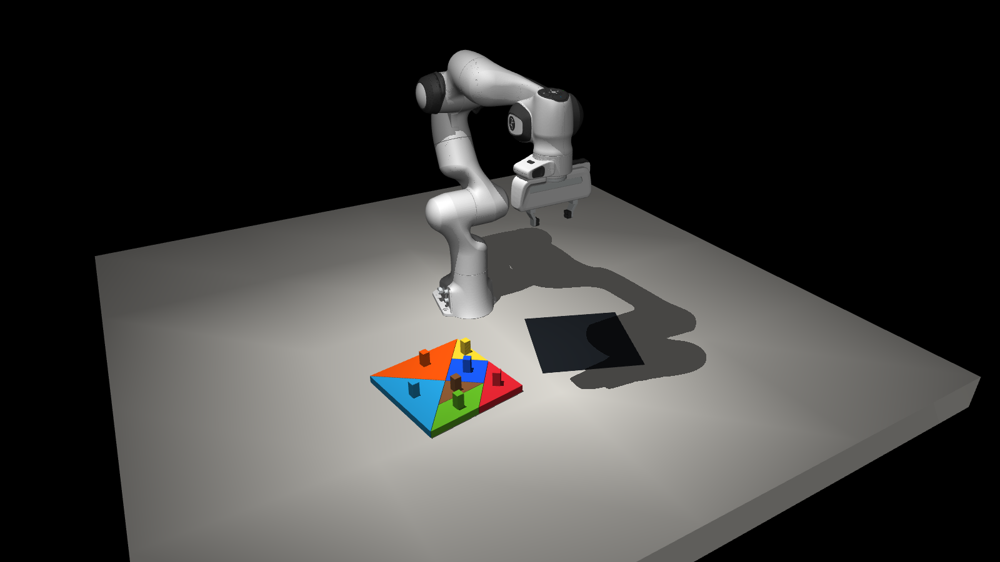

<p align="center">
  
</p>

<h1 align="center">Tangram-Bench</h1>

<p align="center"><b>Seven pieces, one arm, one silhouette. Does the policy generalize to a shape it never saw?</b></p>

<p align="center">
  <a href="https://github.com/murobotics-ai/tangram-bench/actions/workflows/test.yml"></a>
  
  
  
  <a href="LICENSE"></a>
</p>

Tangram-Bench is a small, readable robot-manipulation benchmark that asks one
question and measures it exactly: **can a policy rebuild a tangram silhouette it
was never trained on?** A Franka Panda starts with the seven pieces packed as a
square, sees the target silhouette painted on the table, and has to assemble it.
Success is a global constraint over all seven pieces, scored by exact geometry.
Everything runs in simulation on one laptop with an 8 GB GPU, in about 4,900 lines
of plain Python: record demonstrations, train a policy, evaluate it on seen and
unseen shapes, and compare results by seed. The current headline is the
reference controller at **39 of 40 assemblies**; the first learned baseline is
pending (see [Results](#results)).

## The problem in one minute

- **Pieces.** The classic seven-piece dissection, 5 mm slabs with a square knob
  on each centroid. The knob is the only intended grasp, so the benchmark
  measures *where each piece goes*, not how to pinch a thin slab off a table.
- **Start.** The pieces are packed as a square; its yaw comes from a 45° grid
  and its centre from a 3×3 grid of ±3 cm, both indexed by the seed.
- **Goal.** A silhouette drawn on the table, yaw on a 30° grid and centre on a
  3×3 grid of ±1.5 cm, again indexed by the seed: 72 distinct scenes per
  figure and split, seeds 0–71, after which the sequence repeats, so a
  dataset's coverage is a statement, not a sample (see the protocol's scene
  design). Every piece stays
  between 0.28 and 0.66 m from the base, the arm's comfortable field: square,
  rectangle or the classic tangram house (body, roof, chimney) for training, and
  the **cat**, which no policy trains on. The policy also gets a text prompt.
- **Observation.** Either exact state (joint angles, piece poses, goal outline)
  or two cameras, top and wrist, at 320×240. The contract is recorded with every
  result.
- **Language.** The prompt names the figure: *Solve the tangram puzzle to
  assemble the house.* Demonstrations also carry a numbered plan, one step per
  piece, and a per-frame subtask sentence, the kind of label many VLAs train
  on: *SUBTASK 3/7: Carry the orange large triangle to the right of the house
  and align it.* Exported datasets store them in LeRobot's own language
  columns. Policies never see them at evaluation; the replay viewer shows the
  label changing over time.
- **Action.** Absolute joint targets in radians plus gripper opening in [0, 1],
  at 50 Hz, one action or a chunk per call.
- **Success.** Silhouette IoU ≥ 0.87, footprint overlap ≤ 6%, every piece at
  least 85% inside the silhouette, within 8° of flat and 4 mm of the table, all
  still for half a second. The thresholds
  are calibrated on sampled layouts with every piece 5 mm off and turned up to
  3° (one failure in 10,000 samples); 10 mm on every piece fails in most
  samples. The test is about how the figure is assembled more than where it
  sits: the whole assembly shifted 10 mm can still pass. The benchmark measures
  whether the policy inferred the figure and the order of the pieces, not
  millimetre control. The final IoU is reported alongside for precision (the
  inset pieces cap it at 0.979).
- **Splits.** *Train* seeds feed demonstrations; *dev* is the training figures
  rotated 15° off the training grid, poses never seen; *test* is the cat.
  Reporting dev and test side by side is the point: the gap is the
  generalization result.

Why tangram: most manipulation suites check a per-object condition and can be
matched by models that ignore language or collapse under pose randomization
([Jiang et al., 2026](https://arxiv.org/abs/2606.04233)). Here the target is a
silhouette, not a list of poses, so the policy must infer an assignment before any
control problem exists; each placed piece constrains the rest; several
decompositions tile the same outline and all of them score; and the 5 mm
tolerance keeps the score about the assembly, not about servo precision. Frontier vision-language models
still struggle with the planning half alone ([TangramSR,
2026](https://arxiv.org/abs/2602.05570)), which is why the benchmark also has an
API track for language models.

Two caveats, stated plainly. Four public figures and one held-out animal do not
establish broad shape-family generalization; a generated corpus with structural
families is the next milestone. And precise
placement of thin slabs may dominate over reasoning; the reference controller's
failure modes below say how much.

## Quick start

Install [uv](https://docs.astral.sh/uv/) and Git, then:

```bash
uv sync --frozen --extra dev
uv run -m tools.prepare                 # robot assets, pinned upstream revision
uv run view.py --target house           # look at the scene
```

`bash reproduce.sh` runs the whole pipeline below unattended: about half an hour of
demonstrations with ten arms in parallel, two to four hours of fine-tuning and half an hour of evaluation.

## The pipeline

```bash
uv run view.py --teleop --record data/house-teleop        # 1. drive the arm, record demos
uv run -m tools.collect --target house --episodes 60 --workers 10 --watch   # 1'. ten arms at once
uv run -m tools.export data/square data/rectangle data/house --out data/lerobot/train
uv run -m tools.train --policy smolvla                    # 2. fine-tune (lerobot-train)
uv run eval.py --system examples/systems/lerobot.json --obs pixels --max-chunk 50 \
    --split dev --episodes 30 --out outputs/runs/smolvla-dev.json   # 3. evaluate
uv run -m tools.results compare outputs/runs/hold-dev.json outputs/runs/smolvla-dev.json
```

Everything generated lands in three git-ignored folders, so the source tree stays
the source tree:

```text
data/<figure>/<round>/     demonstrations, one npz per episode, one round folder per
                           launch named by its date and time      tools.collect, view.py --record
data/lerobot/<name>/       exported LeRobot dataset, named after its content
                           unless --out says otherwise               tools.export
checkpoints/               pretrained weights from the Hub         tools.train, first run
outputs/train/<name>/      fine-tuning runs; checkpoints/last/pretrained_model is what eval loads
outputs/runs/<name>.json   evaluation results; trajectories in <name>.artifacts/   eval.py
results/                   summaries and the experiment log, committed to git
```

### 1. Demonstrations

`tools/collect.py` takes the silhouette as input, runs train-split seeds with a
policy (default: the reference controller below) and writes one compressed npz
per episode: top and wrist images, `qpos` as state, the commanded action, piece
poses, goal, the figure prompt and the per-frame `subtask` annotation the
demonstrator exposes, at `--fps` frames per second (default 10). Replay one with
`uv run view.py --demo data/house/2026-09-11-15-39-29/episode-3.npz` and watch the
annotation change. A frame's
action is the last command of its 50/fps-tick interval; a policy that predicts one
action per frame and holds it for the interval follows the demonstration to
within about 0.05 rad (the demonstrator may change its command inside the
interval), which is an imitation target, not an exact replay.
Episodes stop four seconds after a held success, once the arm has returned
home. Failed attempts are listed in
`index.jsonl` and skipped unless `--keep-failures`. Every launch is a round:
its episodes land in `data/<figure>/<YYYY-MM-DD-HH-MM-SS>/` (local time;
`--round NAME` picks the folder), so a session of ten arms is ten episode
files in one dated folder, each replayable on its own. `--resume` grows the
newest round with `--episodes` more seeds, the way `lerobot-record --resume`
grows a dataset: it starts after the last seed the round lists, `--offset`
overrides the start, and seeds whose file already exists are skipped, so the
same round can be topped up as many times as wanted. A failed episode is
listed in the index without a file and the arm moves on to its next seed;
rerunning the same seed reproduces the same failure, so `--retry-failed`, which
records every listed seed of a round that has no file, is for after the
demonstrator changed. `tools.export` and
`tools.report` take the figure folder and read every round in it, the newest
copy of a repeated seed winning; a single round works too.

A full-horizon episode takes about a minute of wall time on one core, so
`--workers 10` runs ten arms on ten tables at once, one process each with
headless rendering: about five times the throughput on the laptop (ten arms
record 3,000 steps each in 24 s, one arm in 12 s), for a few hundred megabytes
of GPU memory and about 1.5 GB of RAM per worker at its peak, since a worker
keeps its episode's frames in preallocated arrays until it writes the file. The seeds come out identical to a sequential run (states and actions bit for
bit, camera pixels up to GPU rasterization noise of one unit). `--watch` opens
one 3D scene with all the arms on their own tables, the way multi-robot RL
arenas look, with each arm's seed, progress and current subtask listed; orbit
with the mouse. Physics stays in the worker processes, the window only draws
what they publish. `--watch grid` tiles one camera per arm instead
(`--watch-camera context|top|wrist`). Closing the window does not stop the
collection.

Ten arms in one hall, live, for the four figures (about 5 minutes per figure,
40 episodes each):

```bash
uv run -m tools.collect --target square    --episodes 40 --workers 10 --watch --out data/square
uv run -m tools.collect --target rectangle --episodes 40 --workers 10 --watch --out data/rectangle
uv run -m tools.collect --target house     --episodes 40 --workers 10 --watch --out data/house
uv run -m tools.collect --target cat       --episodes 40 --workers 10 --watch --out data/cat
uv run -m tools.report data/square data/rectangle data/house data/cat   # success, smoothness, stillness
uv run -m tools.collect --target house --episodes 40 --workers 10 --watch --resume   # 40 more, same round
```

When every arm is done the window stays open on the final state until you
close it (Esc); for unattended runs chained one after another, drop `--watch`.
A house episode of 200 s of simulation takes about 80 s of wall time per arm,
and workers beyond the number of episodes are not started.

Teleoperation records the same format. The keyboard stands in for a SpaceMouse:
**W/S A/D Q/E** translate, **Z/X T/G C/V** rotate, **R/F** open and close the
gripper while held, **O** resets, **Shift** is fine motion, **P** pauses, **1/2/3**
switch the main camera, **Esc** exits. Every episode ended by **O** or **Esc** is
saved, and the overlay shows `SOLVED` once the assembly has held.

`tools/export.py` converts folders to one LeRobot v3 dataset:
`observation.images.top`, `observation.images.wrist` (video),
`observation.state` (9: arm joints and fingers), `action` (8: joint targets and
gripper), the figure prompt as task (`--task subtask` appends the annotation
for subtask-conditioned training), the plan and subtask annotations in
LeRobot's `language_persistent` column exactly as `lerobot-annotate` writes
them, and an `episodes.jsonl` sidecar with seed, silhouette, success, prompt,
plan and the annotation segments per episode. Needs the `lerobot` extra:
`uv sync --extra dev --extra lerobot`. Frames stream straight into LeRobot's
encoder threads (no PNG round trip), about 7 s per 200 s episode; the
dataset itself is LeRobot's own format and encoder (AV1, keyframe every two
frames). Without `--out` and `--repo-id` the dataset is named after its
content, `tangram-<figures>-<robot>[-subtask]-<N>ep`, and written to
`data/lerobot/<name>`. `--push` uploads it to the Hub as
`<namespace>/<name>` (`--namespace murobotics`; default the logged-in user),
public unless `--private`, with a card that tabulates episodes, frames, fps,
figures, prompts and fields and explains how the episodes were recorded (log
in first with `hf auth login`); the Hub's LeRobot visualizer then plays it in
the browser.
The 80-episode public sample recorded this way is
[murobotics/tangram-square-rectangle-house-panda-80ep](https://huggingface.co/datasets/murobotics/tangram-square-rectangle-house-panda-80ep)
(20 square, 30 rectangle, 30 house, all solved; `results/2026-09-11-hf-demos-panda.json`).

### 2. Train a policy

The first baseline is **SmolVLA** (LeRobot, ~450 M parameters): the only
vision-language-action model that fine-tunes on an 8 GB laptop GPU. Measured here:
batch 4 peaks at 2.4 GB. ACT is the cheap non-language control. π0.5 needs 24 GB or
more to fine-tune and about 8 GB of weights at inference, so it is a cloud option
that the same wrapper can run. Sources and numbers: [results/LOG.md](results/LOG.md).

```bash
uv run -m tools.train --policy smolvla --steps 20000      # add --dry-run to see the command
```

`tools/train.py` is a thin front for `lerobot-train`: it downloads
`lerobot/smolvla_base` and its SmolVLM2 backbone to `checkpoints/`, reads
camera and state names from the dataset, re-plans every second (`--n-action-steps
10` at 10 fps; LeRobot's default of 50 is five seconds open loop) and writes the
run to `outputs/train/smolvla/`. Any other flag passes through unchanged, so
`--batch_size=2` or `--resume=true` work as in LeRobot. `--policy act` trains the
control baseline the same way.

### 3. Evaluate

```bash
uv run eval.py --policy policy.py --split dev --episodes 30 --out outputs/runs/hold-dev.json
uv run eval.py --system examples/systems/lerobot.json --obs pixels --max-chunk 50 \
    --split dev --episodes 30 --out outputs/runs/smolvla-dev.json
uv run eval.py --system examples/systems/lerobot.json --obs pixels --max-chunk 50 \
    --split test --episodes 10 --out outputs/runs/smolvla-test.json
uv run -m tools.results verify outputs/runs/smolvla-dev.json
uv run -m tools.results compare outputs/runs/hold-dev.json outputs/runs/smolvla-dev.json
```

Evaluation runs seeded episodes of 300 simulated seconds, saves every state and
action, and never overwrites a result. Policy exceptions count as failures and
stay in the denominator; the summary carries a 95% Wilson interval. `verify`
recomputes every score from the saved trajectory without the policy; `compare`
pairs two runs by seed and refuses to mix observation contracts, splits or
horizons. Use a multiple of three dev episodes for equal counts per figure.

To plug in your own policy, copy `policy.py` and implement
`Policy(robot, seed).act(observation)`; return one action or a `(K, 8)` chunk with
`--max-chunk K`. `examples/systems/lerobot.json` points
`examples/lerobot_policy.py` at the run's `checkpoints/last/pretrained_model`; the wrapper predicts one
chunk per call and repeats each action 50/fps ticks, so `--max-chunk` is
`n_action_steps × 50 / fps`.

## Language models over an API

The second track asks whether a frontier language model, given the cameras and
the state, can drive the arm at all. `adapters.py` sends each observation to the
OpenAI Responses API or the Anthropic Messages API and parses a JSON chunk of
joint actions back. With `--obs pixels` both cameras go along as images.

```bash
cp .env.example .env            # put your keys and model IDs there; .env is git-ignored
uv run eval.py --system examples/systems/openai.json --obs pixels --max-chunk 25 \
    --episodes 3 --steps 3000 --out outputs/runs/openai-dev.json
uv run eval.py --system examples/systems/anthropic.json --obs pixels --max-chunk 25 \
    --episodes 3 --steps 3000 --out outputs/runs/anthropic-dev.json
```

The system files name the model through `TANGRAM_OPENAI_MODEL` and
`TANGRAM_ANTHROPIC_MODEL`, request structured JSON output, and log every request,
response and token count next to the trajectory (never the key). Keep
`--max-chunk` at 25 or more: each call is one round trip, and an episode of 3,000
control steps at chunk 25 is 120 calls. Set `chunk_size` in the system file to
match. These runs cost real money; the audit sidecar reports token usage so the
bill is predictable.

Asking a language model for joint angles every tick is the harshest possible
contract, so a second adapter, `agent.py`, gives the model a tool-calling
interface instead: the model sees the tool pose, the gripper opening
and both cameras, and answers with exactly one tool call, `move_to` or
`move_by` with a note explaining the motion, or `done` / `give_up` with what it
wishes it had known. The adapter interpolates the tool point at 0.06 m/s
(0.03 m/s when descending with the gripper closed, so the piece does not creep
out of the pinch), solves the damped IK of `teleop.py` for every control tick
and emits ordinary joint chunks; unreachable targets are rejected with the IK residual and three
rejections in a row are a policy error. The notes land in the trajectory as
`subtask`, so `view.py` shows what the model said it saw while it moved.

```bash
uv run eval.py --system examples/systems/agent-anthropic.json --obs pixels --max-chunk 25 \
    --episodes 3 --out outputs/runs/agent-anthropic-dev.json
uv run eval.py --system examples/systems/agent-openai.json --obs pixels --max-chunk 25 \
    --episodes 3 --out outputs/runs/agent-openai-dev.json
```

The budget is `max_calls` tool calls per episode (80 by default; a piece takes
about eight) and the full 300 s horizon, during which simulated time waits for
the model. `use_state: true` adds the piece poses and the goal outline to the
text and records `access = "state"`; by default the model gets proprioception
and pixels only. `inference_calls` in the result counts policy queries, one per
chunk; `policy_usage.requests` counts the model calls.

## Reference controller

`examples/oracle.py` assembles any silhouette from its solution certificate using
only the joint-action interface and physical contact. It chooses among the four
equivalent knob grasps and two carry heights by checking IK at pickup, transit and
placement, along the path and not only at its corners, and counting the arm's
self-collisions, which IK cannot see. It glides into the grasp configuration,
carries with the hand vertical and corrects the grasp in yaw only (a slab pivots
in the pinch, so tilting the hand after it winds the wrist up), hovers above the
target, descends slowly, releases 4 mm above the table once the piece is observed
within 2.5 mm and 2.5°, re-grasps a piece it loses and re-places one that lands on
a neighbour, re-plans a phase that stalls for 3 s, lowers a badly held slab to
the table before letting go (a drop from carry height flips it knob-down), gives
a piece up after three attempts rather than ending the episode, and re-places
whatever the success test still rejects after the first pass. Carries run at
0.06 m/s: at 0.07 and 0.08 m/s the slab slips out of the pinch (measured, 40
seeds each). Peak TCP accelerations are about 3 m/s² (5 m/s² at most, from the
velocity vector at 10 fps) and no still interval exceeds 7 s, so the
demonstrations are smooth and never hang. It declares `access = "oracle"` and is a data generator and an execution
ceiling, never a leaderboard entry.

## Results

Reference controller, Panda, train seeds 0–9 per figure on the designed scene
grid, 15,000 steps, 2026-09-11, sources of the commit that carries this README
(every step is logged in [results/LOG.md](results/LOG.md)):

| Silhouette | Success at the horizon | Sustained during the episode | 95% Wilson (horizon) | Final IoU of successes | Median time to first success |
| --- | --- | --- | --- | --- | --- |
| square | 10/10 | 10/10 | 0.72–1.00 | 0.970–0.979 | 209 s |
| rectangle | 10/10 | 10/10 | 0.72–1.00 | 0.941–0.979 | 205 s |
| house | 10/10 | 10/10 | 0.72–1.00 | 0.943–0.979 | 204 s |
| cat | 9/10 | 9/10 | 0.60–0.98 | 0.909–0.979 | 207 s |
| **all** | **39/40** | **39/40** | | | |

"At the horizon" is the benchmark's number (`eval.py`, the test holds over the
last 25 steps of 300 s); "sustained" is what the demonstration collector counts
(the test held for 0.5 s at any point, after which the episode stops four
seconds later, arm home). They agree because an accepted assembly is never
touched again and a repair only starts when it can finish.
| SmolVLA, dev / test | pending | | | |
| OpenAI / Anthropic, dev | pending | | | |

Successful episodes are scored at the tolerance above; most still land within
1–2 mm (final IoU 0.95 or better in 34 of the 39). They take about 205 s of
the 300 s horizon. The remaining failure is a slip cascade: a large triangle
slipped out of the pinch at 52 s, later placements landed 1–2 cm off, and the
repairs did not fit in the time left. In-pinch creep of 4–13 mm
per carry is the physical limit of the knob grasp; carrying faster than
0.06 m/s or stiffening the contacts both lost more assemblies than they saved. The arm never
stands still for more than 5 s in any recorded episode: a phase that makes no
progress for 3 s (6 s with a piece in hand) is re-planned, and after the first
pass over the seven pieces the controller re-places any piece the success test
rejects instead of holding; an accepted assembly is never touched again. Every experiment,
including the negative ones, is in [results/LOG.md](results/LOG.md); summaries are
committed in `results/` and raw trajectories stay in `outputs/runs/`.

## Reference

- [docs/protocol.md](docs/protocol.md): the contract. Units, seeds, observation
  fields, scoring rules, artifact formats, comparison rules.
- `uv run view.py --result outputs/runs/x.json --episode 0` replays a saved episode
  from its recorded model and states; `uv run -m tools.history outputs/runs` builds
  a local history page next to the results.

```text
env.py                  scene, reset, state and pixel observations, CPU/GPU physics (472 lines)
tangram.py              piece geometry and exact scoring (247)
shapes.py               silhouettes, certificates, splits, prompt (126)
benchmark.py            action chunks, trajectory scoring, Wilson and paired statistics (198)
eval.py                 seeded runner, failure accounting, result artifacts (416)
adapters.py             local checkpoints, HTTP, OpenAI and Anthropic policies
agent.py                tool-calling language-model agent: Cartesian targets, IK, one call per turn (649)
policy.py               the policy interface, 19 lines, holds position
teleop.py               keyboard TCP targets through damped IK (151)
view.py                 viewer, teleoperation, recording, replay (388)
replay.py               episode reconstruction (120)
tools/prepare.py        robot assets at a pinned revision
tools/collect.py        record demonstrations for one silhouette
tools/export.py         episodes -> LeRobot v3 dataset
tools/train.py          lerobot-train with the laptop defaults and the repo paths
tools/results.py        verify and compare results offline
tools/history.py        local history page
tools/report.py         demonstration folders -> success, stillness and smoothness metrics
examples/oracle.py      reference controller (630)
examples/lerobot_policy.py  LeRobot checkpoint as a pixel policy
examples/systems/       system files: hold, http, openai, anthropic, agent-openai, agent-anthropic, lerobot
tests/                  geometry, physics, evaluation, pixels, data, viewer
results/                result summaries and the experiment log, committed
data/, checkpoints/, outputs/  demonstrations; downloaded weights; training and evaluation runs (git-ignored)
reproduce.sh            the whole pipeline
```

Read `policy.py` → `tangram.py` → `env.py` → `eval.py`.
